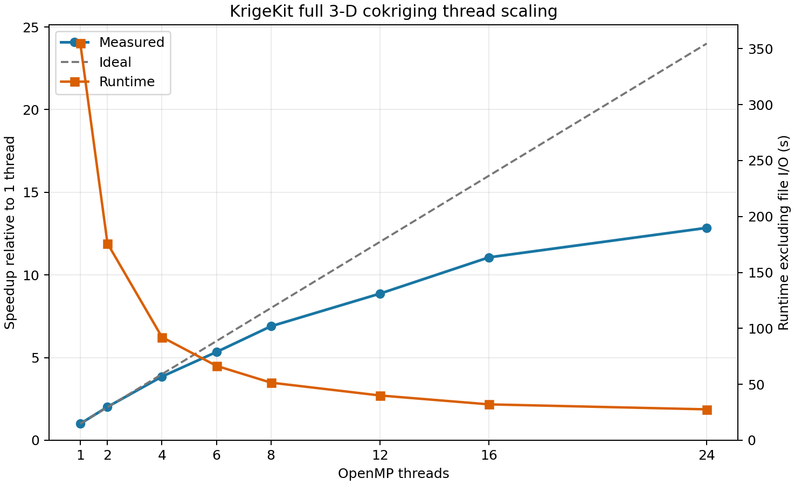

# KrigeKit

[](https://pypi.org/project/krigekit/)
[](https://pypi.org/project/krigekit/)
[](https://github.com/ougx/krigekit/actions/workflows/build_wheels.yml)

**An integrated Python–Fortran toolkit for variogram analysis, kriging, and
geostatistical simulation.**

KrigeKit combines a high-performance OpenMP-parallel Fortran engine with
Python workflows for experimental variograms, anisotropy analysis, model
fitting, kriging, cokriging, and conditional simulation.

| Capability | Notes |
|---|---|
| Variogram analysis and fitting | 1-D/2-D/3-D and space-time workflows, directional analysis, anisotropy, maps, nested models, and cross-variograms |
| Ordinary and simple kriging | Point and block support |
| Co-kriging | Linear Model of Coregionalization |
| Universal kriging / KED | External drift variables |
| Gradient / no-flow constraints | Derivative observations and zero-gradient (no-flow) boundaries |
| Score transforms | Normal-score / uniform quantile transforms for kriging and SGSIM |
| Sequential Gaussian Simulation | Reproducible paths, multiple realizations |
| Space-time kriging | Sum-metric and product-sum ST models |
| Multiple Indicator Kriging / SIS | Categorical variables, three cross-variogram strategies |
| Spatially Varying Anisotropy | Per-block variogram |
| Cross-validation | Leave-one-out |
| Kriging weight reuse | Store and replay weights |

**[Full documentation →](https://krigekit.readthedocs.io/en/latest/)**

---

## Installation

**pip**

```bash
pip install krigekit
```

Pre-built binary wheels are available for:

| Platform | Architecture | Minimum OS |
|---|---|---|
| Linux | x86\_64 | manylinux\_2\_28 (RHEL 8 / Ubuntu 20.04 equivalent) |
| macOS | arm64 (Apple Silicon) | macOS 14 Sonoma |
| macOS | x86\_64 (Intel) | macOS 15 Sequoia |
| Windows | x86\_64 | Windows 10 / Server 2019 |

Requires **Python 3.10, 3.11, or 3.12**.

**conda / mamba**

Install via pip inside a conda environment:

```bash
conda create -n krigekit python=3.12
conda activate krigekit
pip install krigekit
```

---

## Quick start

```python
import numpy as np
from krigekit import Kriging, VariogramModel

x, y = np.meshgrid(np.arange(5.0), np.arange(5.0))
obs_coord = np.column_stack((x.ravel(), y.ravel()))
obs_value = np.sin(x.ravel() / 2.0) + 0.6 * np.cos(y.ravel() / 2.0)
grid_coord = np.mgrid[0:4.1:0.5, 0:4.1:0.5].reshape(2, -1).T

# Analyze and fit the variogram.
model = VariogramModel()
model.set_obs(obs_coord, obs_value)
model.calc_experimental(cutoff=5.0, verbose=False)
model.calc_average(h_width=0.5)
model.set_vgm(vtype="sph", nugget=0.0, sill=0.8, a_major=3.0)
model.fit(
    p0=(0.8, 3.0, 0.0),
    bounds=((0.0, 0.25, 0.0), (5.0, 20.0, 2.0)),
    weight_col=("variogram", "count"),
    inplace=True,
)
model.plot()

# Apply the fitted model to the compiled kriging engine.
k = Kriging()
k.set_obs(ivar=1, coord=obs_coord, value=obs_value)
k.set_grid(coord=grid_coord)
model.apply_to(k, ivar=1, jvar=1)
k.set_search()
k.solve()
df = k.get_result_df()
del k
```

For directional and space-time variogram fitting, co-kriging, SGSIM, indicator
simulation, and the full class API, see the
[user guide](https://krigekit.readthedocs.io/en/latest/user_guide/) and
[gallery examples](https://krigekit.readthedocs.io/en/latest/examples/).

---

## Repository structure

```
krigekit/
├── src/
│   ├── libkriging/      Fortran kriging engine
│   ├── sparks/          Pilot-point kriging/SGSIM CLI
│   └── krigekit/        Python API, variogram analysis, fitting, and C bindings
├── examples/            Sphinx-Gallery example scripts
├── tests/               pytest test suite
├── test_data/           CSV/image data used by tests and examples
├── docs/                Sphinx documentation source
├── build_lib.py         Fortran compile script
├── environment.yml      conda/mamba development environment
└── pyproject.toml       pip package configuration
```

---

## Contributing

**Building from source**

A Fortran compiler is required (gfortran ≥ 10 or Intel ifx/ifort).

```bash
# Clone and set up the development environment
git clone https://github.com/ougx/krigekit.git
cd krigekit

# Compile the Fortran library
python build_lib.py --compiler gfortran      # Linux / macOS
python build_lib.py --compiler gfortran      # Windows (MinGW via MSYS2)
python build_lib.py --compiler ifx           # Windows (Intel oneAPI)

# Install in editable mode with dev dependencies
pip install -e ".[dev]"
```

Additional build options:

```bash
python build_lib.py --opt debug        # debug build, no optimization
python build_lib.py --no-openmp        # disable OpenMP
python build_lib.py --hcache 0         # disable factor cache
```

**Workflow**

1. Fork the repository and create a feature branch.
2. Add tests for any new behavior.
3. Run `pytest` to confirm all tests pass.
4. Open a pull request.

---

## Performance

This benchmark uses 100,000 target cells, all 506,645 primary observations,
all 1,205,193 secondary observations for cokriging, 30-point moving
neighborhoods, and equivalent anisotropic exponential models. Runtime includes
constructor/model/search setup, prediction, and result retrieval; file input
and output are excluded.

| Package | 3-D OK | 3-D CK | Result |
|---|---:|---:|---|
| **KrigeKit, 1 thread** | **1.340 s** | **8.512 s** | Completed |
| **KrigeKit, default threads** | **0.303 s** | **1.178 s** | Completed |
| gstat 2.1.6 | 18.06 s | 79.11 s | Completed |
| GSLIB (recompiled, gfortran -O3) | 245 s† | 978 s† | Completed |
| PyKrige 1.7.3 | — | — | Full-source setup requires ≈1.87 TiB (1,912 GiB) |
| GSTools 1.7.0 | — | — | No native moving-neighborhood search |

At one thread, KrigeKit was 13.5× faster than gstat for OK and 9.29× faster
for CK. With its default OpenMP setting, the advantage increased to 59.5× and
67.2× respectively. Recompiled with gfortran -O3 and run with a standard
3×-range search radius, GSLIB completed the full source in 4.1 minutes (OK)
and 16.3 minutes (CK) — far slower than gstat and parallel KrigeKit, but it
completes. The original >hour projection came from a 24-year-old binary and an
unbounded search radius (≈10,000× the range) that defeated kt3d's super-block
index.

† GSLIB combines input, computation, and formatted output, so its wall time is
not directly comparable to the I/O-excluded runtimes. PyKrige offers a
neighborhood-count argument, but still constructs global source-pair arrays
before local prediction; it was guarded rather than allowed to exhaust system
memory.

For a secondary 10,000-target test, an external anisotropic KD-tree reduced the
inputs to the union of required neighbors: 2,026 primary and 3,796 secondary
observations. The clipping/search time is included below:

| Package | 3-D OK workflow | 3-D CK workflow |
|---|---:|---:|
| **KrigeKit, 1 thread** | **0.206 s** | **1.121 s** |
| **KrigeKit, default threads** | **0.112 s** | **0.397 s** |
| gstat | 0.673 s | 1.606 s |
| GSLIB | 2.277 s | 7.784 s |
| PyKrige | 192.713 s† | — |

PyKrige's prediction itself took 0.48 seconds; 192.14 seconds were spent in
constructor variogram diagnostics. External clipping therefore does not remove
PyKrige's setup bottleneck. Because each package rebuilds its own search tree,
dense distance ties can select slightly different neighborhoods after
clipping.

### How KrigeKit compares

**Runtime.** KrigeKit's main advantage is large local-neighborhood kriging
without global source-pair allocation or a Python target loop.

- On the 100,000-target full-source benchmark, one-thread KrigeKit was 13.5×
  faster than gstat for OK and 9.29× faster for CK.
- With default OpenMP threads, KrigeKit was 59.5× faster than gstat for OK and
  67.2× faster for CK.
- GSLIB, recompiled with gfortran -O3 and given a standard 3×-range search
  radius, completed the full source in 4.1 min (OK) and 16.3 min (CK). Its
  original >hour projection was an artifact of a 24-year-old binary and an
  unbounded search radius that defeated kt3d's super-block index.
- PyKrige could not accept all 506,645 primary observations because its setup
  creates global source-pair arrays.
- In the externally clipped test, one-thread KrigeKit remained about 3.3×
  faster than gstat for OK. PyKrige's constructor dominated its 192.7-second
  workflow.

**Capabilities.**

| Capability | KrigeKit | GSLIB | PyKrige | GSTools | gstat |
|---|---|---|---|---|---|
| 3-D ordinary kriging | Yes | Yes | Yes | Yes | Yes |
| Native moving neighborhood | Yes | Yes | Yes | No | Yes |
| Multivariable cokriging | Yes | Yes | No | No native CK | Yes |
| Per-variable `nmax` / `maxdist` | Yes | Yes | Limited | No | Yes |
| Nested anisotropic variograms | Yes | Yes | Yes | Yes | Yes |
| Automatic variogram fitting | Yes | Separate workflow | Basic | Yes | Yes |
| Space-time covariance models | Yes | Manual/specialized | No | Composable | Yes |
| Block kriging | Yes | Yes | Limited | Yes | Yes |
| Sequential simulation | Gaussian/indicator | Gaussian/indicator | No | Gaussian/fields | Conditional |
| Score transforms/back-transform | Normal/uniform | External | No integrated | External | External |
| Reusable kriging weights | Yes | Limited | No | No local weights | No direct |
| Parallel target execution | OpenMP | Generally serial | Python loop | Custom | Typically serial |
| Primary interface | Python | Parameter files | Python | Python | R |

**Practical positioning.**

- **KrigeKit** is strongest when the problem combines large observation sets,
  millions of targets, local neighborhoods, cokriging, simulation, or reusable
  weights.
- **gstat** is the closest broad statistical comparison and remains attractive
  for R workflows, exploratory variogram analysis, and integration with the R
  spatial ecosystem.
- **GSLIB** remains valuable as an independent legacy reference and provides a
  broad geostatistical toolset. Recompiled (gfortran -O3) and run with a
  standard search radius, kt3d/cokb3d complete the full source in minutes, but
  the parameter-file workflow, text I/O, and serial single-threaded search keep
  it far behind gstat and parallel KrigeKit.
- **GSTools** has an excellent covariance-model and random-field API. It is a
  strong choice for simulation and model composition, but lacks a native
  moving-neighborhood kriging engine.
- **PyKrige** offers a familiar, concise API for small and moderate OK
  problems. Its global constructor diagnostics and Python moving-window path
  limit large-source use, and it does not provide geostatistical cokriging.

### OpenMP scaling

For the full 3-D cokriging case (506,645 primary observations, 1,205,193
secondary observations, and 5,912,940 target cells), KrigeKit scales from
355.23 seconds on one thread to 27.65 seconds on 24 threads:

| Threads | Runtime | Speedup | Efficiency |
|---:|---:|---:|---:|
| 1 | 355.23 s | 1.00× | 100.0% |
| 2 | 175.93 s | 2.02× | 101.0% |
| 4 | 92.21 s | 3.85× | 96.3% |
| 6 | 66.54 s | 5.34× | 89.0% |
| 8 | 51.51 s | 6.90× | 86.2% |
| 12 | 40.05 s | 8.87× | 73.9% |
| 16 | 32.11 s | 11.06× | 69.1% |
| 24 | 27.65 s | 12.85× | 53.5% |



Measured on Windows 11 with an Intel Core i7-13700K (16 cores, 24 logical
processors). Each point is one fresh run from `Kriging(...)` through
`get_results()`; CSV input and output are excluded. Absolute times depend on
hardware, compiler, model, neighborhood, and cache settings.

---

## License

KrigeKit is released under the MIT License — see [LICENSE](LICENSE).

The binary wheels bundle two permissive third-party components, retained under
their own licenses and documented in
[THIRD_PARTY_LICENSES](THIRD_PARTY_LICENSES): the LAPACK linear-algebra
routines (BSD-3-Clause) and the kdtree2 nearest-neighbor search (Academic Free
License v1.1).
