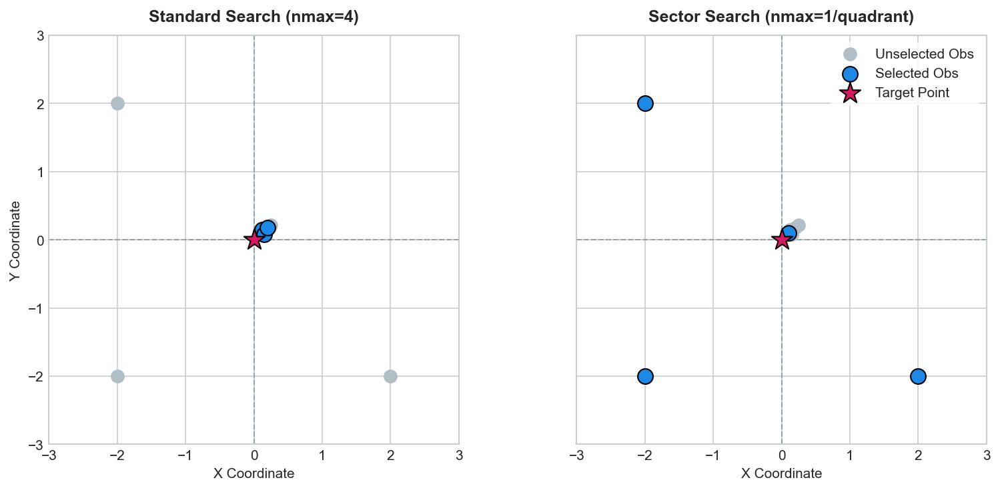

# Ordinary kriging

Ordinary kriging (OK) estimates an unknown value at a target location as a
weighted average of nearby observations, with weights chosen so that the
estimator is unbiased and has minimum variance.

## Minimal example

```python
import numpy as np
from krigekit import ordinary_kriging

rng = np.random.default_rng(42)
obs_coord  = rng.uniform(0, 100, (50, 2))
obs_value  = rng.normal(5.0, 1.0, 50)
grid_coord = np.mgrid[0:101:5, 0:101:5].reshape(2, -1).T  # 21×21 = 441 points

est, var = ordinary_kriging(
    obs_coord, obs_value, grid_coord,
    vgm_spec=dict(vtype="sph", nugget=0.1, sill=0.9, a_major=40.0),
    nmax=20,
)
# est.shape → (441,)   var.shape → (441,)
```

```{eval-rst}
.. plot::

   x = np.linspace(0, 2 * np.pi, 100)
   plt.plot(x, np.sin(x))
```

## Simple kriging

Simple kriging (SK) treats the mean as known rather than estimating it from
the data.  Pass `unbias=0` and a `sk_mean`:

```python
from krigekit import Kriging

k = Kriging(ndim=2, nvar=1, unbias=0)
k.set_obs(ivar=1, coord=obs_coord, value=obs_value, nmax=20,
          sk_mean=float(obs_value.mean()))
k.set_vgm(ivar=1, jvar=1, vtype="sph", nugget=0.1, sill=0.9, a_major=40.0)
k.set_grid(coord=grid_coord)
k.set_search(ivar=1)
k.solve()
est, var = k.get_results()
```

## Anisotropic variogram

Specify different ranges along each axis.  `azimuth` rotates the major axis
clockwise from North (degrees):

```python
from krigekit import Kriging

k = Kriging(ndim=2, nvar=1)
k.set_obs(ivar=1, coord=obs_coord, value=obs_value, nmax=20)
k.set_vgm(ivar=1, jvar=1,
          vtype="sph",
          nugget=0.05, sill=0.95,
          a_major=80.0, a_minor1=30.0,  # 8:3 anisotropy ratio
          azimuth=30.0)                  # NNE–SSW orientation
k.set_grid(coord=grid_coord)
k.set_search(ivar=1)
k.solve()
est, var = k.get_results()
```

## Limiting the search neighbourhood

`nmax` controls the maximum number of neighbours used per kriging system.
A smaller `nmax` is faster but may reduce accuracy in sparse areas.
`maxdist` adds a hard distance cutoff:

```python
k.set_obs(ivar=1, coord=obs_coord, value=obs_value,
          nmax=15, maxdist=50.0)
```

### Sector search

To prevent candidate neighbours from clustering in a single direction (which can happen when data is densely sampled along lines or clusters, leaving other directions unrepresented), you can enable **sector search**.

When `sector_search=True` is passed to `set_search`, the search space is divided into sectors centered on the target prediction point:
- **2D space**: Divided into 4 quadrants.
- **3D space** (and **Space-Time** kriging): Divided into 8 octants.

Under sector search, `nmax` (set in `set_obs`) acts as a limit **per sector** rather than a global limit. The search selects up to `nmax` closest neighbours from each quadrant/octant. This results in a maximum of `4 * nmax` neighbours in 2D, or `8 * nmax` in 3D/ST, ensuring a balanced spatial distribution around the estimation point.

#### Comparison example

The figure below shows a comparison between standard search and sector search. The target location is at the origin `(0, 0)`. There is a dense cluster of observations in Quadrant 1, and only single observations in Quadrants 2, 3, and 4.
- **Standard search (nmax=4)** selects the four closest neighbours, which all fall within the Quadrant 1 cluster. The other directions are not represented.
- **Sector search (nmax=1 per quadrant)** selects the closest neighbour from each quadrant, ensuring that all directions are represented in the kriging weights.



Here is the Python script to run and compare this scenario:

```python
import numpy as np
from krigekit import Kriging

# Target point at the origin
target = np.array([[0.0, 0.0]])

# Observations: a dense cluster in Q1, and sparse points in Q2, Q3, Q4
obs_coord = np.array([
    [0.1, 0.1], [0.12, 0.15], [0.15, 0.08], [0.2, 0.18], [0.25, 0.22], # Q1
    [-2.0, 2.0],                                                       # Q2
    [-2.0, -2.0],                                                      # Q3
    [2.0, -2.0]                                                        # Q4
])
obs_value = np.array([10.0, 10.5, 9.8, 10.2, 10.1, 20.0, 15.0, 25.0])

# 1. Standard search (selects 4 closest, all in Q1)
k_std = Kriging(ndim=2, nvar=1, store_weight=True)
k_std.set_obs(ivar=1, coord=obs_coord, value=obs_value, nmax=4)
k_std.set_vgm(ivar=1, jvar=1, vtype="sph", nugget=0.0, sill=1.0, a_major=10.0)
k_std.set_grid(coord=target)
k_std.set_search(ivar=1, sector_search=False)
k_std.solve()

w_std = k_std.get_weights()
print("Standard selected indices:", w_std["inear"][0, 0, :w_std["nnear"][0, 0]])
# Output: [1, 2, 3, 4]  (all indices from the Q1 cluster)

# 2. Sector search (selects up to 1 per quadrant)
k_sec = Kriging(ndim=2, nvar=1, store_weight=True)
k_sec.set_obs(ivar=1, coord=obs_coord, value=obs_value, nmax=1)
k_sec.set_vgm(ivar=1, jvar=1, vtype="sph", nugget=0.0, sill=1.0, a_major=10.0)
k_sec.set_grid(coord=target)
k_sec.set_search(ivar=1, sector_search=True)
k_sec.solve()

w_sec = k_sec.get_weights()
print("Sector selected indices:", w_sec["inear"][0, 0, :w_sec["nnear"][0, 0]])
# Output: [1, 6, 7, 8]  (one index from each quadrant)
```

Observation coordinates are checked when `set_obs` is called.  Duplicate
coordinate tuples within the same variable are rejected because the search tree
and kriging system require unique observation locations.  Aggregate or remove
duplicate observations before loading them.

## Result clipping

Clip estimates to a physically meaningful range with `bounds`:

```python
k = Kriging(bounds=[0.0, 100.0])
```

Values outside the range are clamped after kriging, which avoids negative
estimates for strictly positive quantities (e.g. porosity, concentration).

## Reusing a Kriging object

You can call `set_obs`, `set_vgm`, `set_grid`, `set_search`, and `solve`
again on the same object to estimate a new dataset without recreating it.
Use `append=False` on `set_vgm` to replace the previous variogram model:

```python
k = Kriging(ndim=2, nvar=1)

for obs_c, obs_v in dataset_sequence:
    k.set_obs(ivar=1, coord=obs_c, value=obs_v, nmax=20)
    k.set_vgm(ivar=1, jvar=1, vtype="sph", sill=1.0, a_major=40.0,
              append=False)     # ← reset variogram each iteration
    k.set_grid(coord=grid_coord)
    k.set_search(ivar=1)
    k.solve()
    est, var = k.get_results()
```

## Cross-validation

Leave-one-out cross-validation reuses the same workflow, switching the grid
to CV mode:

```python
k = Kriging(ndim=2, nvar=1)
k.set_obs(ivar=1, coord=obs_coord, value=obs_value, nmax=20)
k.set_vgm(ivar=1, jvar=1, vtype="sph", nugget=0.1, sill=0.9, a_major=40.0)
k.set_grid_cv(ivar=1)           # estimation targets = leave-one-out positions
k.set_search(ivar=1)
k.solve()
cv_est, cv_var = k.get_results()
```

`cv_est[i]` is the kriging prediction at observation `i` using all other
observations.

## See also

- [Variogram models](../variogram_models.rst) — model types, nesting, anisotropy
- [Array conventions](../array_conventions.md) — coordinate and result shapes
- [API reference](../api/index.md) — full `Kriging` class documentation
